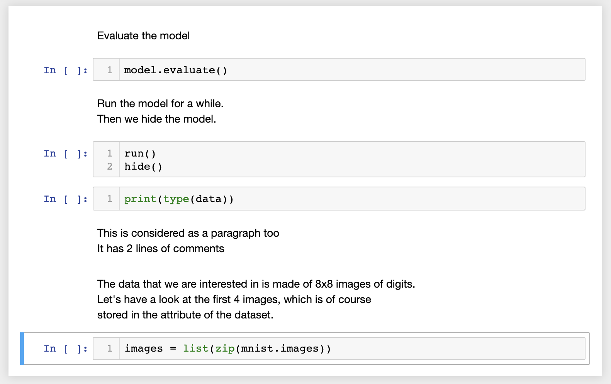

# p2j - Python to Jupyter Notebook Parser [](https://badge.fury.io/py/p2j)

Convert your Python source code to Jupyter notebook with **zero intervention**.

Here is an example.

```python
# Evaluate the model
model.evaluate()

# Run the model for a while.
# Then we hide the model.
run()
hide()

print(type(data))

# This is considered as a paragraph too
# It has 2 lines of comments

# The data that we are interested in is made of 8x8 images of digits.
# Let's have a look at the first 4 images, which is of course
# stored in the `images` attribute of the dataset.  
images = list(zip(mnist.images))
```

which translates to the following:



Here's another example of a [Python source code](p2j/examples/example2.py) and its [Jupyter notebook](p2j/examples/example2.ipynb) after converting.

The purpose of this package is to be able to run a code on Jupyter notebook without having to copy each paragraph of the code into every cell. It's also useful if we want to run our code in Google Colab. This parser isn't perfect, but you would be satisfactorily pleased with what you get.

Contents of this README:

- (Installing)(##Installation)
- [Converting](##Converting)
- [Tests](##Tests)
- [Requirements](##Requirements)
- [Code format](##Code-Format)
- [How it works](##How-it-works)
- [Feedback and pull requests](##Feedback-and-pull-requests)

## Installation

PyPI

```bash
pip install p2j
```

Python's setup.py

```bash
python setup.py install
```

## Converting

There are 3 main ways you can get your Jupyter notebook:

### Converting a Python script

```bash
p2j train.py
```

and you will get a `train.ipynb` Jupyter notebook.

### Converting a script from the Internet (you need to have curl)

Specify the target filename with a `-t`.

```bash
p2j <(curl https://raw.githubusercontent.com/keras-team/keras/master/examples/mnist_cnn.py) -t myfile.ipynb
```

### Converting an in-line Python script

```bash
p2j <(echo "# boilerplate code \n import os") -t myfile2.ipynb
```

Note:

To run examples from this repository, first clone this repo

```bash
git clone https://github.com/raibosome/python2jupyter.git
```

and after you `cd` into the project, run

```bash
p2j examples/example.py
```

The `p2j/examples/example.py` is a Keras tutorial on building an autoencoder for the MNIST dataset, found [here](https://github.com/keras-team/keras/blob/master/examples/mnist_denoising_autoencoder.py).

#### Command line usage

To see the command line usage, run `p2j -h` and you will get something like this:

```txt
usage: p2j [-h] [-r] [-t TARGET_FILENAME] [-o] source_filename

Convert a Python script to Jupyter notebook

positional arguments:
  source_filename       Python script to parse

optional arguments:
  -h, --help            show this help message and exit
  -r, --reverse         To convert Jupyter to Python script
  -t TARGET_FILENAME, --target_filename TARGET_FILENAME
                        Target filename of Jupyter notebook. If not specified,
                        it will use the filename of the Python script and
                        append .ipynb
  -o, --overwrite       Flag whether to overwrite existing target file.
                        Defaults to false
```

## Requirements

- Python >= 3.6

No third party libraries are used.

## Tests

Tested on macOS 10.14.3 with Python 3.6.

## Code format

There is no specific format that you should follow, but generally the parser assumes a format where your code is paragraphed. Check out some examples of well-documented code (and from which you can test!):

- [PyTorch Tutorials](https://pytorch.org/tutorials/beginner/pytorch_with_examples.html)
- [Keras Examples](https://github.com/keras-team/keras/tree/master/examples)
- [Scikit Learn Example](https://scikit-learn.org/stable/auto_examples/classification/plot_digits_classification.html#sphx-glr-auto-examples-classification-plot-digits-classification-py)

## How it works

Jupyter notebooks are just JSON files, like below. A Python script is read line by line and a dictionary of key-value pairs are generated along the way, using a set of rules. Finally, this dictionary is dumped as a JSON file whose file extension is `.ipynb`.

```json
{
    "cells": [
        {
            "cell_type": "markdown",
            "execution_count": null,
            "metadata": {},
            "outputs": [],
            "source": [
                "# Import standard functions"
            ]
        },
        {
            "cell_type": "code",
            "metadata": {},
            "source": [
                "import os"
            ]
        },
    ],
    "metadata": {},
    "nbformat": 4,
    "nbformat_minor": 2
}
```

There are 4 basic rules (and exceptions) that I follow to parse the Python script.

### 1. Code or comment

Firstly, any line that starts with a `#` is marked as a comment. So this will be a **markdown cell** in the Jupyter notebook. Everything else that does not start with this character is considered code, so this goes to the **code cell**. There are of course exceptions.

This is a comment

```python
# Train for 4 epochs
```

and this is code

```python
model.train(4)
```

### 2. Blocks of code and comment

Secondly, code or comment can occur in blocks. A block of comment is several *consecutive* lines of comments that start with `#`. Similarly, several *consecutive* lines of codes that do not start with `#` will be considered as 'a block of code'. This rule is important because we want to ensure that a block of code or comment stays in one cell.

This is a block of comment

```python
# Load the model and
# train for 4 epochs and
# lastly we save the model
```

and this is a block of code

```python
model.load()
model.train(4)
model.save()
```

### 3. Paragraph

Thirdly, I assume that everyone writes his/her script in paragraphs, where each paragraph represents an idea. In a paragraph, there can be code or comments or both.

The following are 5 examples of paragraphs.

```python
# Evaluate the model
model.evaluate()

# Run the model for a while.
# Then we hide the model.
run()
hide()

print(type(data))

# This is considered as a paragraph too
# It has 2 lines of comments

# The data that we are interested in is made of 8x8 images of digits.
# Let's have a look at the first 4 images, which is of course
# stored in the `images` attribute of the dataset.  
images = list(zip(mnist.images))
```

which translates to the following:


### 4. Indentation

Any line of code or comment that is indented by a multiple of 4 spaces is considered code, and will stay in the same code cell as the previous non-empty line. This ensures that function and class definitions, loops and multi-line code stay in one cell.

### 5. Exceptions

Now we handle the exceptions to the above-mentioned rules.

- Docstrings are considered as **markdown cells**, only if they are not indented.

- Lines that begin with `#pylint` or `# pylint` are Pylint directives and are kept as **code cells**.

- Shebang is considered as a **code cell**, eg. `#!/usr/bin/env python3`.

- Encodings like `# -*- coding: utf-8 -*-` are also considered as **code cells**.

## Feedback and pull requests

If you do like this, star me maybe? Pull requests are very much encouraged! Slide into my DM with suggestions too!
